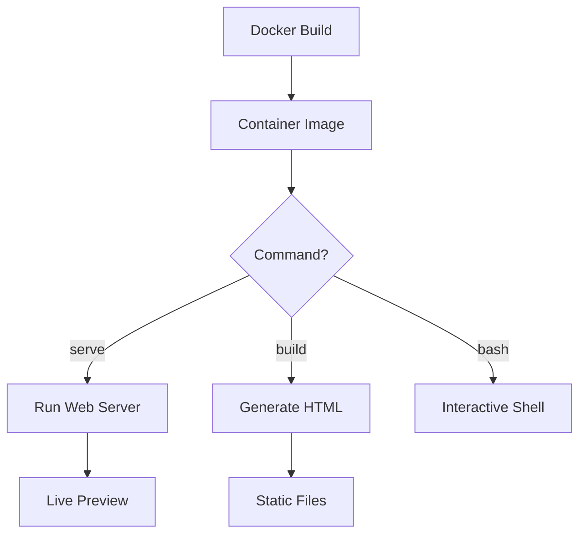
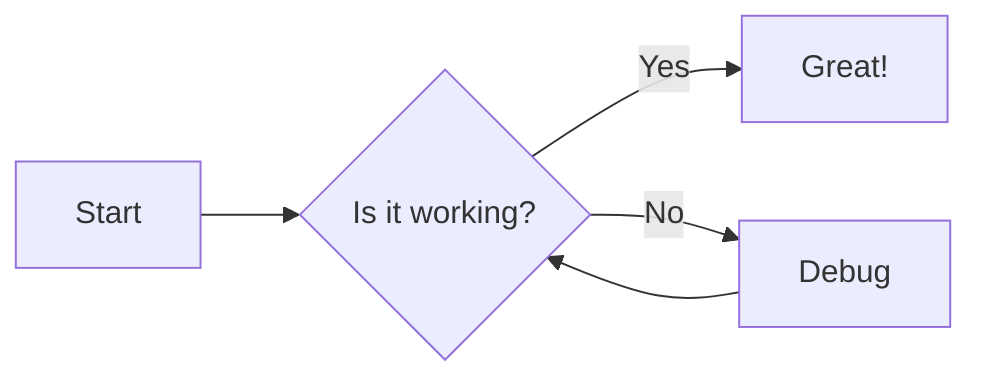
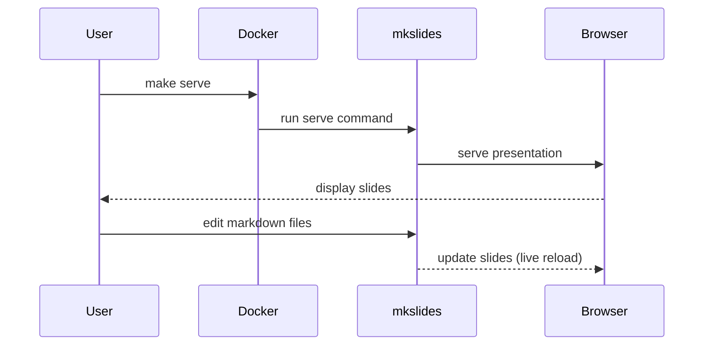
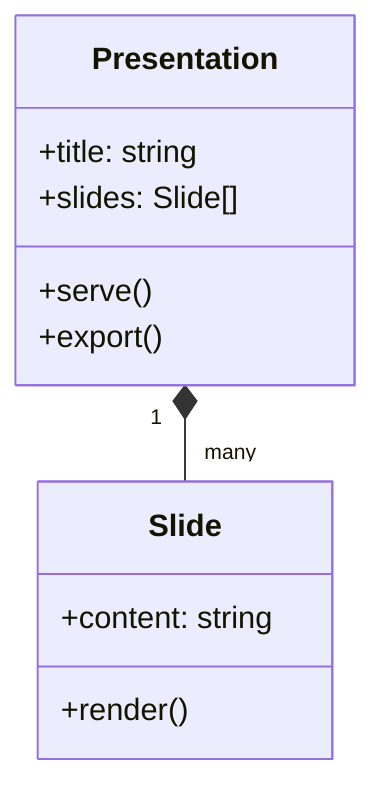
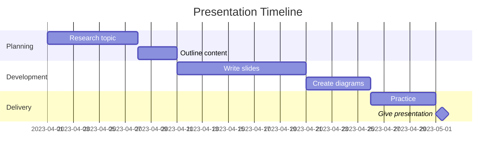
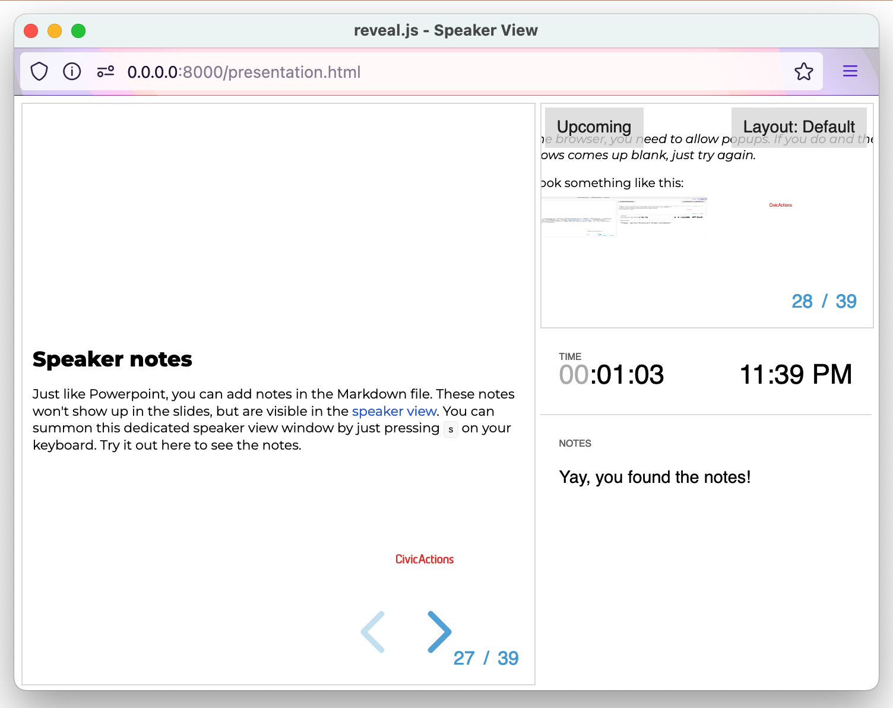
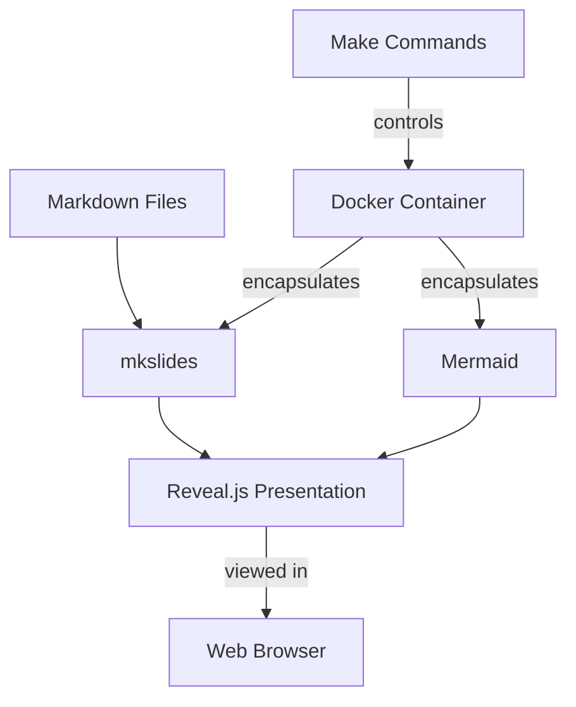

# Creating Presentations with FOSS

---

## A guide to this repository

---

## What is this repository?

A Docker-based toolset for creating presentations using:

- **Markdown** for content
- **Reveal.js** for slides
- **Mermaid** for diagrams
- **mkslides** to tie it all together

---

## Why use this approach?

- **Version control** your presentations
- **Separate** content from presentation
- **Reuse** content across presentations
- **Collaborate** using git workflows
- **Export** to PDF, web, and more

---

## Getting Started

1. Clone this repository
2. Install Docker
3. Run `make serve`

That's it! Your presentation will be available at http://localhost:8000

---
## Using Docker Commands

Alternative to Make for running your presentations

---

## Basic Docker Commands

Run these commands from your project root directory:

```bash
# Build the Docker image
docker buildx build --load --tag foss-presentation .

# Serve slides (live preview on http://localhost:8000)
docker run -it --rm -v "$(pwd)/slides:/slides" -p 8000:8000 foss-presentation serve
```

---

## Building Without Serving

Generate the HTML files without starting the web server:

```bash
# Build slides without serving
docker run -it --rm -v "$(pwd)/slides:/slides" foss-presentation build
```

Output will be available in the `slides/site` directory

---

## Working with Custom Slide Directories

Specify a different directory for your slides:

```bash
# Using a different slides directory
docker run -it --rm -v "$(pwd)/my-presentations:/slides" -p 8000:8000 foss-presentation serve
```

---

## Interactive Shell Access

Get a shell inside the container for troubleshooting:

```bash
# Start a bash shell in the container
docker run -it --rm -v "$(pwd)/slides:/slides" foss-presentation bash
```

---

## Behind the Scenes



---

## Docker vs Make
    
Docker Commands
- More verbose
- Works everywhere Docker is installed
- No additional dependencies
- More transparent

Make Commands
- Shorter, easier to remember
- Hides implementation details
- Consistent interface
- Requires Make to be installed

---

## Tips for Docker Users

1. Use shell aliases for common commands
2. Consider creating a shell script for frequently used options
3. Use Docker Desktop for visual management
4. Build once, run many times for faster workflow

---

## Project Structure

```
foss-presentation/
├── slides/              # Your presentation content
│   ├── assets/          # Images, files, etc.
│   ├── presentation.md  # This file!
│   └── other-slides.md  # Additional slides
├── Dockerfile           # Container definition
├── entrypoint.sh        # Container entry point
├── makefile             # Helper commands
└── README.md            # Documentation
```

---

## Creating Your First Presentation

1. Edit files in the `slides/` directory
2. Use markdown files with a `.md` extension
3. Run `make serve` to see your changes live
4. Use `---` to separate slides

---

## Basic Markdown Syntax

```markdown
# This is a heading

This is a paragraph with **bold** and *italic* text.

- This is a bullet point
- Another bullet point
  - Nested bullet point

1. Numbered list
2. Second item
```

---

## Basic Markdown Example

# This is a heading

This is a paragraph with **bold** and *italic* text.

- This is a bullet point
- Another bullet point
  - Nested bullet point

1. Numbered list
2. Second item

---

## Adding Images

```markdown

```

For local development:

```markdown

```

---

## Code Snippets

```python
def hello_world():
    print("Hello, FOSS presentation!")
```

```javascript
function greet() {
    console.log("Hello from JavaScript!");
}
```

---

## Creating Flow Diagrams with Mermaid



---

## Sequence Diagrams



---

## Class Diagrams



---

## Gantt Charts



---

## Custom Layouts

Split content into columns:

```html
<div class="columns">
  <div>
    This is the left column content.
  </div>
  <div>
    This is the right column content.
  </div>
</div>
```

---

## Custom Layouts Example

<div class="columns">
  <div>
    
### Left Column

- Point one
- Point two
- Point three

  </div>
  <div>
    
### Right Column

1. Step one
2. Step two
3. Step three

  </div>
</div>

---

## Advanced Features

- **Speaker notes**: Add notes only you can see
- **Slide transitions**: Fade, slide, convex, concave, etc.
- **Print to PDF**: Export your presentation
- **Custom themes**: Change colors and styles

---

## Speaker notes

Just like Powerpoint, you can add notes in the Markdown file. These notes won't show up in the slides, but are visible in the [speaker view](https://revealjs.com/speaker-view/). You can summon this dedicated speaker view window by just pressing `s` on your keyboard. Try it out here to see the notes.

Note:

Yay, you found the notes!

---

_Tip: In some browser, you need to allow popups. If you do and the speaker view windows comes up blank, just try again._

It should look something like this:




---

## Custom Themes

Edit the `mkslides.toml` file to change the theme:

```toml
[reveal]
theme = "night"  # Options: black, white, league, beige, sky, night, serif, simple, solarized
```

Available themes: black, white, league, beige, sky, night, serif, simple, solarized

---

## Using Docker Commands

Basic workflow with make commands:

```bash
# Build the Docker image
make build

# Serve your presentation
make serve

# Build slides without serving
make build-slides

# Use a different slides directory
make serve SLIDES_DIR=./my-other-presentation
```

---

## How it Works



---

## Benefits of This Approach

1. **Portable**: Works the same everywhere
2. **Reproducible**: Deterministic builds
3. **Versionable**: Track changes with git
4. **Collaborative**: Easy to share and merge
5. **Flexible**: Use any editor you prefer

---

## Creating Multiple Presentations

1. Create separate directories for each presentation
2. Run with custom path:
   ```bash
   make serve SLIDES_DIR=./presentations/intro
   ```
3. Share common assets across presentations

---

## Exporting Presentations

To export as PDF:

1. Serve your presentation (`make serve`)
2. Open in Chrome/Chromium
3. Append `?print-pdf` to the URL
4. Use browser's print function (Save as PDF)

---

## Tips for Great Presentations

1. Keep content concise
2. Use visual aids (diagrams, images)
3. Follow a logical structure
4. Include examples
5. End with a clear call to action

---

## Contributing

This project is open source!

- Report bugs
- Suggest features
- Submit pull requests
- Share your presentations

---

## Resources

- [Reveal.js Documentation](https://revealjs.com/)
- [Mermaid Diagram Syntax](https://mermaid.js.org/)
- [Markdown Guide](https://www.markdownguide.org/)
- [mkslides Documentation](https://github.com/MartenBE/mkslides)

---

## Made with

<a href="https://revealjs.com/" alt="revealjs logo"></a>
<a href=https://pypi.org/project/mkslides/></a>
<a href="https://mermaid.js.org/" alt="mermaidJs logo"></a>
<a href="https://www.markdownguide.org/"></a>
</p>

---

## Thank You!

Start creating your own presentations:

```bash
git clone https://github.com/sharjeelaziz/foss-presentation.git
cd foss-presentation
```
```bash
make serve
```

or

```bash
docker buildx build --load --tag foss-presentation .
docker run -it --rm -v "$(pwd)/slides:/slides" -p 8000:8000 foss-presentation serve
```

Questions? Open an issue on GitHub!